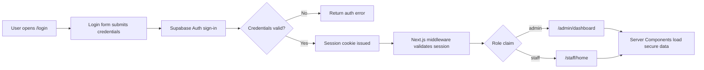
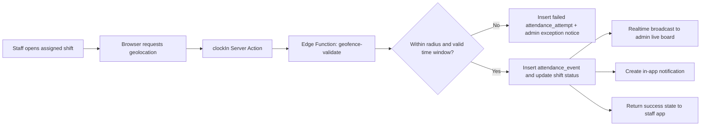
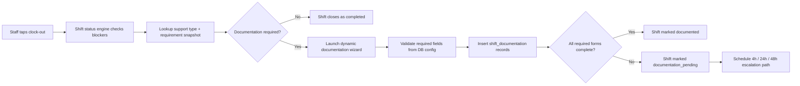

# PHASE_1_ARCHITECTURE

Last updated: 2026-04-12  
Phase: Phase 1 planning only  
Target branch: `claude/vividcare-platform-design-cV21z`

## Purpose

This document is the Phase 1 source of truth for VividCare, a single-tenant care workforce, rostering, attendance, compliance, and NDIS service documentation platform for one disability/support care business.

Phase 1 does not generate product code. It defines the production architecture, feature map, workflows, user experiences, MVP boundary, and project structure required to build the platform with:

- Next.js App Router
- TypeScript
- Tailwind CSS
- shadcn/ui
- Supabase Auth, Postgres, Storage, Realtime, and Edge Functions

The design intent is a calm operations product: admin users work from a command-center interface, while staff use a mobile-first PWA that answers one question quickly: "What do I need to do right now?"

---

## 1. System Architecture Overview

### 1.1 Architecture principles

- Single tenant by default. The system serves one care business, so access control is role- and assignment-based rather than tenant-scoped.
- Compliance first. Attendance, documents, incidents, and NDIS documentation are operational records, not optional notes.
- Server-authoritative mutations. All create/update/delete flows run through validated Server Actions or trusted backend handlers, never direct browser writes.
- Defense in depth. Every sensitive action is enforced in three layers: route protection, server authorization, and row-level security.
- Auditability over convenience. Destructive deletes are avoided for regulated records; records are archived, versioned, or appended to immutable logs.
- Mobile staff, desktop admin. Admin workflows optimize for dense review and scheduling. Staff workflows optimize for speed, clarity, and low-friction data entry.

### 1.2 Logical architecture

```text
CLIENT LAYER
|-- Admin Portal (desktop-first)
|   |-- Next.js App Router pages under /admin/*
|   |-- Dashboard, scheduler, tables, slide-overs, analytics widgets
|   `-- Command palette, bulk actions, review queues
`-- Staff App (mobile-first PWA)
    |-- Next.js App Router pages under /staff/*
    |-- Home, calendar, shift detail, docs, incidents, profile
    `-- Bottom nav, quick actions, geolocation, notifications

APPLICATION LAYER
|-- Next.js Middleware
|   |-- Session validation
|   |-- Role gating
|   `-- Redirects for /admin/* and /staff/*
|-- Server Components
|   |-- Route data loading
|   |-- Dashboard aggregation
|   `-- SSR shells for secure pages
|-- Server Actions
|   |-- All product mutations
|   |-- Validation + permission checks
|   `-- Cache revalidation + realtime fan-out triggers
`-- Route Handlers under /api/*
    |-- Auth callbacks
    |-- Webhooks
    |-- Cron entrypoints
    `-- PDF/export streaming endpoints

SUPABASE LAYER
|-- Auth
|   |-- Email/password
|   |-- Password reset
|   |-- Session cookies
|   `-- app_metadata role claims
|-- PostgreSQL
|   |-- Operational tables
|   |-- Compliance tables
|   |-- Shift and attendance state
|   |-- Dynamic NDIS form config
|   `-- RLS policies, triggers, audit functions
|-- Storage
|   |-- staff-documents
|   |-- client-documents
|   |-- agreements
|   |-- incident-attachments
|   `-- policy-hub
|-- Realtime
|   |-- Shift status broadcast
|   |-- Incident alerts
|   |-- Notification center updates
|   `-- Attendance board refresh
`-- Edge Functions
    |-- geofence-validate
    |-- expiry-monitor
    |-- ndis-compliance-check
    |-- payment-summary-calc
    `-- notification-dispatch

EXTERNAL SERVICES
|-- Browser Geolocation API
|-- Email provider (Resend preferred, SendGrid supported)
`-- PDF rendering adapter for exports and signed agreements
```

### 1.3 Layer responsibilities

| Layer | Responsibility | Notes |
| --- | --- | --- |
| Admin Portal | Dense operational management | Desktop-first with responsive tablet support |
| Staff App | Shift execution and self-service | Mobile-first PWA with install prompt and push-ready shell |
| Middleware | Entry guard only | Prevents obvious route misuse but is not the sole auth control |
| Server Actions | All trusted mutations | Applies validation, permission checks, status changes, notifications |
| Route Handlers | Integration endpoints | Webhooks, cron triggers, exports, auth callbacks |
| Supabase Auth | Identity and session source | Roles stored in `app_metadata.role` as `admin` or `staff` |
| Postgres | System of record | Business rules enforced by schema, triggers, and RLS |
| Storage | Binary files and generated PDFs | Bucket privacy differs by use case |
| Realtime | Operational awareness | Live board, incident alerts, in-app notifications |
| Edge Functions | Compute-intensive checks | Geofence math, expiry scans, compliance and pay calculations |

### 1.4 Core domain boundaries

- Identity boundary: `auth.users` stores login identity; business profile tables store application data such as staff profile, employment attributes, and client assignments.
- Operational boundary: roster, shift, attendance, incident, and notification tables represent live business operations.
- Compliance boundary: documents, agreements, NDIS rules, dynamic form definitions, and approval states are isolated for traceability and reporting.
- Audit boundary: immutable event logs capture who changed what, when, and from where.
- File boundary: files live in Storage; metadata, review state, expiry, and ownership live in Postgres.

### 1.5 Cross-cutting technical decisions

- Use UUID primary keys on all business tables.
- Use `created_at`, `updated_at`, `created_by`, and `updated_by` on mutable operational tables.
- Prefer `archived_at` / `archived_by` over hard deletes for staff, clients, and shifts.
- Use status enums for stable workflows: shift status, incident status, document status, notification status, agreement status, and documentation status.
- Snapshot mutable rules onto shifts at publish time when those rules affect compliance or payroll logic. This avoids historical drift.
- Use append-only audit tables for sensitive records rather than rewriting history.

### 1.6 Supabase capabilities by feature

| Capability | Used for | Key implementation note |
| --- | --- | --- |
| Auth | Login, reset password, session cookies | Admin creates staff auth users with server-side privilege only |
| Postgres | All application entities | RLS on every user-facing table |
| Storage | Documents, attachments, signed PDFs | Private buckets for regulated documents |
| Realtime | Live roster board and notifications | Subscribe by role and assignment scope |
| Edge Functions | Geofence, expiry, compliance, pay logic | Keeps expensive logic off the browser and out of SQL triggers |

### 1.7 Data flow diagrams

#### Auth flow



#### Clock-in flow



#### Post-shift NDIS documentation flow



### 1.8 Security and audit posture

- Middleware guards route entry but does not replace authorization inside Server Actions.
- Every Server Action resolves the current user, checks role, checks ownership/assignment, then performs the mutation.
- RLS prevents cross-user reads and writes even if a client attempts direct API access.
- Attendance attempts, document reviews, incident state changes, and approved NDIS documentation all emit audit entries.
- Signed records and approved documentation become immutable; amendments create new versions rather than overwriting the original record.

---

## 2. Complete Module List

The platform breaks into 16 domains and approximately 87 functional modules.

| Domain | Goal | Key modules |
| --- | --- | --- |
| Auth & Identity | Secure entry and role-aware sessions | login, forgot-password, reset-password, session-management, role-gate, profile |
| Client Management | Maintain service recipients and funded support context | client-list, client-create, client-detail, client-edit, client-archive, client-documents-and-service-config |
| Staff Management | Maintain workforce records and assignment readiness | staff-list, staff-create, staff-detail, staff-edit, staff-archive, staff-documents-and-availability |
| Document & Compliance Engine | Track regulated records and expiry | document-types-config, document-upload, review-queue, expiry-tracker, renewal-workflow, compliance-status |
| Rostering & Scheduling | Build and publish workable rosters | scheduler-calendar, create-shift, assign-staff, publish-roster, conflict-detection, bulk-create-and-templates |
| Attendance (Geofenced) | Verify presence and exception handling | clock-in, clock-out, live-board, geofence-config, exceptions, attendance-history |
| Shift Management | Manage shift lifecycle after publication | active-shifts, shift-detail, shift-history, status-engine, amendments-and-break-tracking |
| Agreements & Signatures | Manage service and consent agreements | agreement-templates, agreement-generate, digital-sign, status-tracking, expiry-and-renewal |
| Incident Reporting | Capture and resolve risk events | incident-report-form, incident-list, incident-detail, incident-status-workflow, real-time-escalation |
| Notifications | Deliver action-oriented alerts | in-app-center, email-dispatch, push-dispatch, user-preferences, template-library |
| NDIS Service Documentation | Enforce post-shift evidence requirements | support-types-config, documentation-requirements, support-log, case-notes, roster-confirmation, compliance-dashboard, audit-export |
| Payment / Payroll Prep | Prepare pay-ready summaries without full payroll integration | shift-hours-calc, pay-rate-rules, summary-generation, approval, CSV-and-PDF-export |
| Audit & Logging | Preserve operational traceability | activity-log, row-change-tracking, login-history, export |
| Admin Dashboard | Surface operational health in one place | KPI-cards, compliance-widget, roster-widget, incident-and-staff-widget |
| Staff Mobile Experience | Focus the worker on current duties | todays-shifts, upcoming-calendar, quick-actions, notification-feed, me |
| Settings & Configuration | Control organization-wide defaults | org-profile, geofence-defaults, shift-rules, document-types, notification-rules, NDIS-config-and-pay-rates |

### 2.1 Module ownership notes

- Admin-owned domains: Clients, Staff, Rostering, Documents, Agreements, Payroll, Audit, Dashboard, Settings.
- Shared domains: Attendance, Shift Management, Incident Reporting, Notifications, NDIS documentation.
- Staff-owned domains: My profile, my documents, my assigned shifts, my notifications.

### 2.2 Hidden system modules that must exist even if not user-facing

- Requirement snapshotting for shifts
- Realtime channel publisher
- Notification deduplication engine
- Assignment eligibility evaluator
- Compliance score calculator
- Document review queue prioritizer
- Attendance anomaly detector
- Export job recorder

---

## 3. User Role Breakdown (Permission Matrix)

### 3.1 Role model

- `admin`: full operational control for the care business
- `staff`: self-service plus shift-execution access limited to own profile and assigned work

No custom roles are included in MVP. Future roles such as coordinator, finance, or compliance reviewer can be added later, but the Phase 1 architecture optimizes for a clear admin/staff split.

### 3.2 Module-level permission matrix

| Domain | Admin permissions | Staff permissions | Enforcement highlights |
| --- | --- | --- | --- |
| Auth & Identity | Create staff users, reset passwords, manage all profiles, view role-gated routes | Login, reset own password, read/update own profile subset | Middleware blocks route groups; RLS limits profile rows to `auth.uid()` |
| Client Management | Full CRUD on all clients, service config, archive/unarchive, client document visibility | Read only clients linked to assigned shifts and only operational details needed for care delivery | Staff cannot browse the full client list |
| Staff Management | Full CRUD on all staff profiles, qualifications, availability, documents, assignable state | Read/update own profile subset, upload own documents, update own availability when enabled | Sensitive employment fields remain admin-only |
| Document & Compliance | Configure document types, review uploads, approve/reject, override statuses, view all compliance queues | Upload own documents, view own status, read published policy-hub documents | Storage path ownership and RLS must align |
| Rostering & Scheduling | Full CRUD, publish/unpublish, resolve conflicts, assign/reassign | Read own roster only | Staff never mutate roster records directly |
| Attendance | View all attendance, configure geofence, resolve exceptions, amend audited errors | Create own clock-in/out, create own attendance exceptions, read own history | Insert limited to assigned active shift and valid window |
| Shift Management | View/edit all shifts, run state corrections, approve amendments | Read own shift detail, submit break events, complete shift tasks, request amendments | Shift state transitions run through status engine |
| Agreements & Signatures | Full CRUD on templates and generated agreements, send, renew, archive | Capture signatures when authorized during a live workflow, read agreements relevant to own work | Signed PDFs immutable after completion |
| Incident Reporting | View all incidents, change statuses, assign investigators, close out | Create incidents tied to own shifts, read incidents they submitted, add follow-up before final lock | Critical incidents alert admins immediately |
| Notifications | Manage templates, rules, broadcast/admin notices, view all unread queues | Read own notifications, manage own preferences, mark own messages read | Realtime channels are user-scoped |
| NDIS Service Documentation | Configure support types, form requirements, review/approve, audit export, compliance dashboards | Submit required forms for own shifts, edit drafts before approval, read own submissions | Shift cannot become `documented` until required forms complete |
| Payment / Payroll Prep | Generate summaries, approve, export CSV/PDF, override pay interpretations | Read only own approved pay summaries and period totals | Staff never access other users' pay data |
| Audit & Logging | Read/export all audit logs | No direct audit module access; limited visibility through own shift timeline only | Sensitive system logs remain admin-only |
| Admin Dashboard | Full visibility into KPI widgets and drilldowns | No access | Middleware and server checks both required |
| Staff Mobile Experience | Read-only support view if impersonation/support tooling is added later | Full access to own home, calendar, docs, incidents, notifications, profile | Every data source remains assignment- or identity-scoped |
| Settings & Configuration | Full CRUD on org settings, rules, notification templates, NDIS config, pay rate rules | No access | Settings routes exist under `/admin/*` only |

### 3.3 Three-layer enforcement model

| Layer | What it protects | Example |
| --- | --- | --- |
| Middleware | Route entry | Redirect a staff user away from `/admin/payroll` before page render |
| Server Actions | Business permission and workflow rules | Reject `approveDocument` unless current user is admin |
| RLS | Row-level data access | Staff can read only their own `attendance_events` and only assigned-client `client_profiles` |

### 3.4 Recommended RLS patterns

- `staff_profiles`: admin `select/insert/update`; staff `select/update` only on own row
- `client_profiles`: admin full access; staff `select` only where an assigned shift exists in permitted time horizon
- `shifts`: admin full access; staff `select` only assigned rows
- `attendance_events` and `attendance_attempts`: admin full access; staff `select` own rows, `insert` own rows only through validated server-side call
- `documents`: admin full access; staff `select/insert` own documents only
- `incident_reports`: admin full access; staff `select/insert/update` only incidents created by them or tied to their shifts before resolution lock
- `shift_documentation`: admin full access; staff `select/insert/update` own shift documentation drafts only
- `notifications`: user-scoped reads and state updates only

---

## 4. Key Workflows (10 Critical Flows)

### 4.1 Staff onboarding

1. Admin creates a new staff profile in draft state with employment type, qualifications, contact details, and required document checklist.
2. A trusted backend action creates the linked Supabase Auth user and assigns `app_metadata.role = staff`.
3. The system sends a welcome email with a set-password or reset-password link.
4. Staff logs in, completes missing profile details, and uploads required compliance documents to the private storage bucket.
5. Admin reviews documents and either approves, rejects, or requests resubmission with comments.
6. The compliance engine calculates readiness based on required documents, expiry state, and mandatory profile fields.
7. Once all blocking requirements are satisfied, `assignable = true`, the staff member appears in scheduler assignment results, and the onboarding event timeline is complete.

### 4.2 Client onboarding

1. Admin creates a client record with NDIS number, address, emergency contacts, funded support types, and service notes.
2. The system creates the client service configuration, including funded support types, plan start/end dates, roster rules, and visit address.
3. Admin configures geofence defaults for the client site, including radius and early/late tolerance windows.
4. If the service requires signed agreements, admin generates a service agreement packet from the approved template library.
5. Client or representative signs the agreement digitally on-device or through a guided signature session.
6. The agreement PDF, metadata, and expiry are stored; the client becomes fully active once mandatory service config and agreement requirements are complete.
7. The client is now assignable in the scheduler and visible in documentation requirement lookups.

### 4.3 Shift creation and assignment

1. Admin opens the scheduler in day, week, fortnight, month, or tabular mode.
2. Admin creates a shift with client, date, start/end time, support type, notes, and any required qualifications or forms.
3. The system runs conflict checks for staff availability, overlapping shifts, expired documents, hour-cap breaches, and qualification mismatches.
4. The shift is saved as `draft` until staffing and review are complete.
5. Admin manually assigns a staff member or uses suggestion ranking, then reviews the rationale before confirming.
6. Admin publishes the shift; publication snapshots relevant support rules and requirements for downstream audit and payroll logic.
7. Staff receives an in-app notification, and the shift appears in the staff calendar and admin live board.

### 4.4 Clock-in / clock-out (geofenced)

1. Staff opens the assigned shift and taps `Clock in`.
2. The browser requests precise location permission and captures device coordinates plus timestamp.
3. `clockIn` calls the geofence Edge Function, which calculates Haversine distance against the configured shift address and validates the allowed time window.
4. Every attempt is written to `attendance_attempts`, including failures such as denied GPS, out-of-range location, or early/late breach.
5. On success, an `attendance_event` row is created, shift status transitions to `on_site`, and a realtime broadcast updates the admin live board.
6. During the shift, break events, incidents, missing signatures, and documentation blockers are appended to the shift timeline.
7. On `Clock out`, the system checks required signatures, required forms, and documentation rules before allowing final completion or moving the shift into `documentation_pending`.

### 4.5 Incident reporting

1. Staff opens the active shift and chooses `Report incident`.
2. The form captures incident type, severity, timestamp, description, people involved, and optional photo or attachment.
3. Submission writes the incident record, links it to the shift and client, and appends a timeline event.
4. Admin receives an immediate in-app notification; critical incidents are also eligible for SMS/push escalation when Phase 2 notifications go live.
5. Incident status moves through `reported -> acknowledged -> investigating -> resolved -> closed`.
6. Every status change requires actor, timestamp, and optional internal notes for audit.
7. Closed incidents remain searchable and reportable, but the original narrative remains immutable.

### 4.6 Document upload and compliance

1. Staff or admin uploads a file into the correct private bucket with document type, owner, issue date, and expiry date metadata.
2. The metadata row is created in `pending_review` state and enters the admin review queue.
3. Admin approves, rejects, or requests resubmission with review notes.
4. The expiry monitor runs daily and creates reminders at 45, 30, 14, and 7 days before expiry.
5. When a document expires, the compliance engine recalculates readiness and can block staff assignment if the document is marked mandatory.
6. Previous versions remain retained for audit even after a renewal document is approved.

### 4.7 Agreement signing

1. Admin selects an agreement template and merges client/staff variables into a generated document.
2. The generated agreement is presented on a device, with the signer identity, sign context, and timestamp captured.
3. Signature is collected using a canvas signature pad or approved fallback flow.
4. The signed PDF is composited, stored in the agreements bucket, and linked to metadata including expiry and renewal window.
5. Status moves through `draft -> sent -> signed -> expiring -> expired`.
6. Agreement renewal reminders follow the same expiry engine used for compliance documents.
7. This workflow is fully designed in Phase 1 but deferred from launch MVP implementation.

### 4.8 Post-shift NDIS documentation

1. Clock-out or shift completion triggers a lookup of the shift support type and its requirement snapshot.
2. The system determines which forms are required: support log, case note, roster confirmation, and optionally other configured forms.
3. Staff enters a guided documentation wizard with one form at a time and minimal typing where possible.
4. The form renderer uses database-defined field configuration, order, options, and validation rules.
5. Submission enforces required fields and stores JSONB payload plus structured metadata.
6. When all required forms are complete, shift status moves to `documented`; otherwise it remains `documentation_pending`.
7. Escalations occur at 4 hours, 24 hours, and 48 hours, ending in an overdue compliance flag if still incomplete.

### 4.9 Expiry notification

1. A daily scheduled function queries documents and agreements approaching expiry.
2. Items are grouped by severity window and deduplicated so the same reminder is not re-sent unnecessarily.
3. The system creates in-app notifications and, when enabled, email notifications for the owner and relevant admins.
4. If an item reaches expiry, status changes to `expired`, compliance is recalculated, and downstream blockers are applied.
5. The reminder engine records each send in an audit table to support evidence of notification activity.
6. Renewal upload or manual override clears future reminders and resets the compliance state.

### 4.10 Payment summary

1. Admin selects a pay period and optionally filters by staff, location, or support type.
2. The payment calculation function loads approved attendance, break entries, shift classifications, public holiday rules, and overtime thresholds.
3. The system calculates regular, evening, weekend, holiday, overtime, paid break, and unpaid break totals using configured pay-rate rules.
4. Admin reviews draft summaries, resolves exceptions, and approves the period.
5. Staff can view only their own approved summaries and period totals.
6. CSV and PDF exports are generated for payroll handoff or archive.
7. This workflow is architected in Phase 1 but deferred from launch MVP implementation.

---

## 5. Admin vs Staff Experience Design

### 5.1 Admin UX: Command Center

The admin product should feel like an operations control room rather than a generic dashboard. The desktop experience is dense, review-oriented, and optimized for fast state changes.

- Layout: `TopBar (64px) + Sidebar (240px) + Main Content (max-width 1280px)`
- Navigation: persistent left sidebar with route groups for dashboard, roster, staff, clients, documents, incidents, payroll, notifications, settings
- Home: dashboard or scheduler, depending on role preference; scheduler remains the primary daily workspace
- Primary patterns: data tables, calendar views, slide-over create/edit panels, batch actions, status badges, KPI cards, drilldown widgets
- Secondary patterns: command palette (`Cmd+K`), breadcrumbs, quick actions, saved filters, review queues
- Preferred interaction model: edit in context, avoid full-page form detours where practical

### 5.2 Admin information architecture

- Dashboard: KPI cards, compliance alerts, vacant shifts, active incidents, expiring documents, staff availability anomalies
- Scheduler: multi-view calendar plus tabular roster mode, conflict banners, assignment suggestions
- Review queues: documents awaiting approval, overdue NDIS documentation, incident follow-ups, agreement renewals
- Analytics widgets: concise and action-oriented, not vanity charts

### 5.3 Staff UX: "What do I need to do right now?"

The staff product should reduce cognitive load and typing. Every screen should bias toward the next action.

- Layout: `TopBar (48px) + Scrollable Content + Bottom Nav (56px)`
- Navigation: Home, Calendar, Docs, Me
- Home screen priorities: current shift, next shift, required documentation, urgent notifications, outstanding compliance tasks
- Primary patterns: single-purpose cards, large action buttons, checklists, progress states, short forms, guided wizards
- Progressive disclosure: show summary first, detail on tap
- Input strategy: selects, toggles, segmented choices, chips, predefined reasons, and dynamic form sections

### 5.4 Staff mobile/PWA behaviors

- Installable to home screen
- Fast resume into current shift context
- Large tap targets for clock-in, breaks, incidents, and documentation
- Camera/file attachment support for incident and document workflows
- Realtime badge counts for urgent notifications
- Online-first behavior in MVP; offline drafts are deferred

### 5.5 Shared UX rules

- Status must be visible in one glance using consistent badges and timeline entries.
- Every review-heavy admin page needs filters, sort, and empty/loading/error states.
- Every staff action should explain blockers clearly, especially for signatures, documentation, and clock-out.
- Regulated workflows should never silently fail; every exception generates a visible state and a recoverable next step.

---

## 6. Feature Dependency Map and Build Order

### 6.1 Dependency map

```mermaid
flowchart LR
  L0["Level 0: Auth, Settings, Schema + RLS"] --> L1["Level 1: Staff + Client Management"]
  L1 --> L2["Level 2: Document + Compliance, Agreements + Signatures"]
  L2 --> L3["Level 3: Rostering + Scheduling"]
  L3 --> L4["Level 4: Attendance + Incident Reporting"]
  L4 --> L5["Level 5: Shift Management + History"]
  L5 --> L6["Level 6: NDIS Service Documentation Engine"]
  L6 --> L7["Level 7: Notifications Engine"]
  L7 --> L8["Level 8: Payment / Payroll Prep + Audit / Logging"]
  L8 --> L9["Level 9: Admin Dashboard + Staff Mobile Home"]
```



### 6.2 Dependency rationale

- Level 0 must exist first because every secure route and mutation depends on identity, configuration defaults, schema, and RLS.
- Staff and client records must exist before shifts, documents, incidents, or NDIS requirements can reference them.
- Compliance engines should exist before broad roster publishing so assignment checks use real readiness signals.
- Attendance depends on published shifts and client geofence settings.
- Shift history and documentation depend on attendance and lifecycle state.
- Notifications cut across all domains and should integrate only after upstream events are stable.

### 6.3 Recommended 13-sprint build order

This sprint plan covers the whole product roadmap. MVP ends after Sprint 9.

| Sprint | Outcome | Key deliverables |
| --- | --- | --- |
| 1 | Project foundation | Next.js scaffold, Tailwind + shadcn setup, env strategy, Supabase init, design tokens, CI/linting |
| 2 | Auth and route protection | Supabase Auth, role claims, middleware, session handling, base RLS helpers, org settings |
| 3 | Core schema and admin settings | Migration foundation, enums, audit helpers, geofence defaults, shift rules, notification rules |
| 4 | Staff management | Staff CRUD, auth-user creation flow, qualifications, compliance readiness shell |
| 5 | Client management | Client CRUD, service config, support types, geofence settings, client detail views |
| 6 | Document and compliance engine | Storage buckets, upload flows, review queue, expiry tracker, compliance status |
| 7 | Scheduler and shift publishing | Calendar views, shift CRUD, conflict detection, assignment, publish flow |
| 8 | Attendance and incidents | Geofenced clock-in/out, live admin board, exception handling, incident reporting |
| 9 | Shift lifecycle and NDIS documentation | Shift status engine, history, documentation wizard, compliance dashboard, staff mobile home |
| 10 | Notifications hardening | In-app center, template system, digest logic, email plumbing |
| 11 | Agreements and signatures | Template merge, signature capture, signed PDF storage, renewal tracking |
| 12 | Payroll prep and audit export | Hours calc, approval flow, CSV/PDF export, admin audit views |
| 13 | Dashboard refinement and polish | KPI aggregation, performance tuning, accessibility pass, mobile polish, final ops dashboards |

### 6.4 MVP cut line

MVP should launch after Sprint 9, with Sprints 10-13 treated as post-launch or Phase 2 expansion depending on business readiness.

---

## 7. MVP Scope Definition

### 7.1 In MVP

These features together create a usable, compliance-ready care operations platform.

- Auth with role-based routing
- Staff CRUD and client CRUD
- Document upload with expiry tracking and compliance status
- Shift creation, assignment, and calendar views
- Geofenced clock-in/out with admin notifications
- Shift status state machine and history
- Incident reporting with realtime admin alerts
- NDIS service documentation engine for post-shift compliance forms
- In-app notification center
- Admin dashboard with KPI widgets
- Staff mobile home with today's shifts
- Basic settings for organization, geofence defaults, shift rules, and NDIS config

### 7.2 Deferred to Phase 2+

These are designed now so the architecture supports them, but they should not delay launch.

| Deferred item | Target phase | Why deferred |
| --- | --- | --- |
| Digital signature agreements | Phase 2 | Valuable but not required for launch if manual agreements remain temporarily acceptable |
| Payment / payroll prep | Phase 2 | Launch can operate before payroll export automation is finished |
| Bulk shift creation and templates | Phase 2 | Helpful efficiency feature, not operationally mandatory for first release |
| Email and push notifications | Phase 2 | In-app notifications cover launch-critical alerting |
| Audit log export | Phase 2 | Internal audit visibility matters first; export can follow |
| Offline PWA mode | Phase 2 | Online-first reduces sync and compliance complexity |
| AI chatbot / assistant | Phase 3 | Useful accelerator, not launch critical |
| Custom roles | Phase 3 | Admin vs staff is sufficient for first operating model |

### 7.3 MVP acceptance definition

MVP is successful when:

- An admin can onboard staff and clients, publish shifts, and see live operational state.
- A staff member can complete an entire shift workflow on mobile, including attendance, incident capture, and required documentation.
- Compliance blockers prevent unsafe or non-compliant operations from being hidden.
- The system maintains an audit trail for every critical workflow.

---

## 8. NDIS Compliance Engine Design

### 8.1 Objective

The NDIS compliance engine turns service documentation from a freeform notes problem into a configurable evidence system. It must support different support types, different required forms, dynamic fields, escalations, audit history, and immutable approved records.

### 8.2 Core data model

| Table | Purpose | Key columns |
| --- | --- | --- |
| `ndis_support_types` | Registry of supported service types and item numbers | `id`, `name`, `ndis_item_number`, `category`, `active` |
| `ndis_doc_requirements` | Required form rules per support type | `id`, `support_type_id`, `form_code`, `required`, `approval_required`, `effective_from`, `effective_to` |
| `ndis_form_fields` | Dynamic field definitions per form | `id`, `form_code`, `field_name`, `field_type`, `validation_rules`, `options_json`, `display_order`, `active` |
| `client_support_config` | Which funded support types apply to a client | `id`, `client_id`, `support_type_id`, `plan_start`, `plan_end`, `budget_reference`, `notes` |
| `shift_requirement_snapshots` | Frozen documentation requirement set at publish time | `id`, `shift_id`, `support_type_id`, `requirements_json`, `form_version_hash` |
| `shift_documentation` | Completed form payloads and workflow state | `id`, `shift_id`, `client_id`, `staff_id`, `form_code`, `version`, `status`, `payload_json`, `submitted_at`, `approved_at`, `approved_by` |
| `shift_documentation_audit` | Immutable change log for every documentation action | `id`, `shift_documentation_id`, `action`, `actor_id`, `from_status`, `to_status`, `metadata_json`, `created_at` |

### 8.3 Key design decisions

- Forms are rendered dynamically from database config. The UI should never hard-code NDIS form layouts that belong in configuration.
- Requirement rules are snapshotted onto each shift at publish time so later config changes do not rewrite history.
- Required fields are enforced at submission by shared validation logic driven from `ndis_form_fields`.
- A shift cannot reach `documented` status until all required forms in the snapshot are complete.
- Documentation escalation timeline is fixed at 4 hours, 24 hours, and 48 hours after shift end.
- Approved documentation becomes immutable. Any correction creates a new version linked to the same shift and form code.

### 8.4 Documentation state machine

```text
not_required
pending
in_progress
submitted
approved
rejected
overdue

Allowed transitions:
pending -> in_progress -> submitted
submitted -> approved
submitted -> rejected -> in_progress -> submitted
approved -> amended version only (never overwrite prior approved row)
pending/in_progress/submitted -> overdue
```

### 8.5 Dynamic form rendering contract

Each form definition should support:

- field label
- field key
- field type (`text`, `textarea`, `select`, `multiselect`, `boolean`, `date`, `time`, `number`, `signature-ref`, `file-ref`)
- validation rules (`required`, `min`, `max`, regex, conditional requirements)
- display order
- help text
- option list
- conditional display rules

The rendered submission payload should include:

- `answers`
- `completed_by`
- `completed_at`
- `device_context`
- `shift_context`
- `requirement_snapshot_hash`

### 8.6 Escalation design

- `+4h`: reminder to assigned staff member
- `+24h`: staff reminder plus admin notification
- `+48h`: overdue flag on shift, admin dashboard alert, compliance metric impact

Escalations should stop when all required forms are submitted or when an admin explicitly overrides with an audited reason.

### 8.7 Audit and approval behavior

- Every draft save, submit, approve, reject, and amend event writes to `shift_documentation_audit`.
- Admin approval can be required per form type, not globally.
- Audit export should reconstruct exactly which requirements applied to a shift and which version satisfied them.
- If a form is rejected, the rejection reason is stored and visible to the staff member in the resubmission flow.

### 8.8 Why this architecture is audit-friendly

- It preserves the original requirement set through snapshotting.
- It separates mutable draft workflow from immutable audit history.
- It avoids hidden business logic in the client by centralizing configuration and validation.
- It supports regulator-facing evidence exports without scraping UI state.

---

## 9. Design Direction

### 9.1 Visual direction

The product should feel modern, professional, minimal, and operationally calm. The UI references provided show strong patterns worth keeping: a disciplined app shell, strong hierarchy, clear status surfaces, and action-first widgets. For production, the palette should shift from concept-lime to a more care-domain appropriate indigo/slate system while keeping crisp contrast and direct status signaling.

### 9.2 Color system

| Token | Value | Usage |
| --- | --- | --- |
| Primary | `Indigo-600` / `#4F46E5` | Primary CTA, active nav, selected states |
| Neutral 900 | `#0F172A` | Headings, high-emphasis text |
| Neutral 700 | `#334155` | Body text, secondary emphasis |
| Neutral 200 | `#E2E8F0` | Borders, dividers |
| Neutral 50 | `#F8FAFC` | App background, table canvas |
| Success | `Emerald-500` / `#10B981` | Approved, active, valid |
| Warning | `Amber-500` / `#F59E0B` | Expiring, pending attention |
| Error | `Red-500` / `#EF4444` | Critical, blocked, overdue |
| Info | `Sky-500` / `#0EA5E9` | In-progress, informational |
| Compliance accent | `Teal-500` / `#14B8A6` | NDIS compliance widgets and documentation states |

### 9.3 Typography

- Primary typeface: Inter
- Monospace: JetBrains Mono
- Tailwind default type scale with restrained customization
- Admin headings should be compact and strong; staff headings should be slightly larger and more legible at arm's length

### 9.4 Layout and component rules

- Admin app shell: persistent sidebar, content-first layout, sticky filters where useful
- Staff app shell: bottom nav, large primary action zone, minimal chrome
- Status badges: globally consistent color semantics across documents, incidents, shifts, and notifications
- Tables: sticky header, sortable, filterable, selectable, paginated
- Cards: white background, rounded-xl, restrained shadow, one primary action
- Forms: labels above fields, inline validation, required asterisk, grouped sections
- Calendar: month and scheduler views with colored shift dots and time-slot blocks

### 9.5 Motion and feedback

- Use restrained transitions on state changes, drawers, dialogs, and tab switches
- Favor instant feedback on tap followed by server-confirmed state
- Realtime updates should animate subtly, not distractingly
- Avoid decorative motion in compliance-critical flows

### 9.6 Accessibility and usability

- Touch targets minimum `44x44`
- Color is never the only status indicator; pair color with text/icon
- All critical actions have loading, success, and failure feedback
- Keyboard support is required for admin tables, dialogs, and command palette
- Contrast target: WCAG AA minimum on all operational surfaces

### 9.7 shadcn/ui direction

Use shadcn/ui as the design-system foundation with these core primitives:

- button
- input
- textarea
- select
- checkbox
- radio-group
- switch
- label
- form
- card
- table
- badge
- tabs
- dialog
- sheet
- drawer
- popover
- dropdown-menu
- command
- breadcrumb
- separator
- tooltip
- calendar
- scroll-area
- avatar
- skeleton
- progress
- sonner/toast

---

## 10. Next.js Project Folder Structure

### 10.1 Target repository structure

```text
supabase/
|-- migrations/
|   |-- 0001_extensions_and_enums.sql
|   |-- 0002_auth_profiles_and_roles.sql
|   |-- 0003_staff_profiles_and_qualifications.sql
|   |-- 0004_client_profiles_and_service_config.sql
|   |-- 0005_documents_storage_and_compliance.sql
|   |-- 0006_agreements_and_signatures.sql
|   |-- 0007_shifts_and_assignments.sql
|   |-- 0008_attendance_and_geofence.sql
|   |-- 0009_shift_status_timeline_and_breaks.sql
|   |-- 0010_incidents_and_notifications.sql
|   |-- 0011_ndis_support_config.sql
|   |-- 0012_ndis_shift_documentation.sql
|   |-- 0013_payroll_prep.sql
|   `-- 0014_audit_rls_policies_and_triggers.sql
`-- functions/
    |-- geofence-validate/
    |   `-- index.ts
    |-- expiry-monitor/
    |   `-- index.ts
    |-- ndis-compliance-check/
    |   `-- index.ts
    |-- payment-summary-calc/
    |   `-- index.ts
    `-- notification-dispatch/
        `-- index.ts

src/
|-- app/
|   |-- (auth)/
|   |   |-- login/page.tsx
|   |   |-- forgot-password/page.tsx
|   |   `-- reset-password/page.tsx
|   |-- (admin)/
|   |   |-- dashboard/page.tsx
|   |   |-- clients/
|   |   |   |-- page.tsx
|   |   |   |-- new/page.tsx
|   |   |   `-- [id]/page.tsx
|   |   |-- staff/
|   |   |   |-- page.tsx
|   |   |   |-- new/page.tsx
|   |   |   `-- [id]/page.tsx
|   |   |-- roster/page.tsx
|   |   |-- attendance/page.tsx
|   |   |-- shifts/
|   |   |   |-- active/page.tsx
|   |   |   `-- history/page.tsx
|   |   |-- documents/page.tsx
|   |   |-- agreements/page.tsx
|   |   |-- incidents/page.tsx
|   |   |-- notifications/page.tsx
|   |   |-- payroll/page.tsx
|   |   `-- settings/page.tsx
|   |-- (staff)/
|   |   |-- home/page.tsx
|   |   |-- calendar/page.tsx
|   |   |-- shifts/
|   |   |   |-- page.tsx
|   |   |   `-- [id]/page.tsx
|   |   |-- docs/
|   |   |   |-- page.tsx
|   |   |   |-- hub/page.tsx
|   |   |   `-- ndis/[shiftId]/page.tsx
|   |   |-- incidents/page.tsx
|   |   |-- notifications/page.tsx
|   |   |-- me/page.tsx
|   |   `-- support/page.tsx
|   `-- api/
|       |-- auth/callback/route.ts
|       |-- cron/expiry/route.ts
|       |-- cron/notifications/route.ts
|       |-- exports/payroll/route.ts
|       `-- webhooks/email/route.ts
|-- components/
|   |-- ui/
|   |-- layout/
|   |-- data-display/
|   |-- forms/
|   |-- maps/
|   `-- notifications/
|-- hooks/
|-- lib/
|-- providers/
|-- types/
`-- styles/

middleware.ts
```

### 10.2 Admin route groups (12)

- `dashboard`
- `clients`
- `staff`
- `roster`
- `attendance`
- `shifts`
- `documents`
- `agreements`
- `incidents`
- `notifications`
- `payroll`
- `settings`

### 10.3 Staff route groups (8)

- `home`
- `calendar`
- `shifts`
- `docs`
- `incidents`
- `notifications`
- `me`
- `support`

### 10.4 `src/lib` breakdown

#### Supabase clients

- `src/lib/supabase/browser.ts`
- `src/lib/supabase/server.ts`
- `src/lib/supabase/admin.ts`

#### Server Actions (12)

- `auth-actions.ts`
- `staff-actions.ts`
- `client-actions.ts`
- `shift-actions.ts`
- `assignment-actions.ts`
- `attendance-actions.ts`
- `document-actions.ts`
- `agreement-actions.ts`
- `incident-actions.ts`
- `notification-actions.ts`
- `ndis-actions.ts`
- `payroll-actions.ts`

#### Queries (10)

- `auth-queries.ts`
- `staff-queries.ts`
- `client-queries.ts`
- `roster-queries.ts`
- `shift-queries.ts`
- `attendance-queries.ts`
- `document-queries.ts`
- `incident-queries.ts`
- `ndis-queries.ts`
- `dashboard-queries.ts`

#### Validators (9 Zod schema files)

- `auth.schema.ts`
- `staff.schema.ts`
- `client.schema.ts`
- `shift.schema.ts`
- `attendance.schema.ts`
- `document.schema.ts`
- `agreement.schema.ts`
- `incident.schema.ts`
- `ndis.schema.ts`

#### Utils (6)

- `cn.ts`
- `dates.ts`
- `geofence.ts`
- `permissions.ts`
- `status.ts`
- `exports.ts`

### 10.5 `src/components` breakdown

#### `src/components/ui/` primitives (25+)

- accordion
- alert-dialog
- avatar
- badge
- breadcrumb
- button
- calendar
- card
- checkbox
- command
- dialog
- drawer
- dropdown-menu
- form
- input
- label
- popover
- progress
- radio-group
- scroll-area
- select
- separator
- sheet
- skeleton
- switch
- table
- tabs
- textarea
- toast
- tooltip

#### `src/components/layout/` (6)

- `AdminShell.tsx`
- `StaffShell.tsx`
- `SidebarNav.tsx`
- `BottomNav.tsx`
- `TopBar.tsx`
- `CommandPalette.tsx`

#### `src/components/data-display/` (7)

- `StatusBadge.tsx`
- `KpiCard.tsx`
- `ComplianceMeter.tsx`
- `ShiftTimeline.tsx`
- `DataTable.tsx`
- `EmptyState.tsx`
- `NotificationList.tsx`

#### `src/components/forms/` (6)

- `StaffForm.tsx`
- `ClientForm.tsx`
- `ShiftForm.tsx`
- `DocumentUploadForm.tsx`
- `IncidentForm.tsx`
- `DynamicNdisFormRenderer.tsx`

### 10.6 Hooks, providers, and types

#### Hooks (7)

- `use-auth-session.ts`
- `use-realtime-channel.ts`
- `use-geolocation.ts`
- `use-notifications.ts`
- `use-debounce.ts`
- `use-media-query.ts`
- `use-local-storage.ts`

#### Providers

- `AuthProvider.tsx`
- `NotificationProvider.tsx`
- `ThemeProvider.tsx`

#### Types (13)

- `auth.ts`
- `staff.ts`
- `clients.ts`
- `documents.ts`
- `agreements.ts`
- `shifts.ts`
- `attendance.ts`
- `incidents.ts`
- `notifications.ts`
- `ndis.ts`
- `payroll.ts`
- `dashboard.ts`
- `database.ts`

### 10.7 Supabase from-scratch bootstrap sequence

1. Create the Next.js repo and initialize Supabase locally with `supabase init`.
2. Create the hosted Supabase project and record:
   - `NEXT_PUBLIC_SUPABASE_URL`
   - `NEXT_PUBLIC_SUPABASE_ANON_KEY`
   - `SUPABASE_SERVICE_ROLE_KEY`
3. Link the project with `supabase link --project-ref <ref>`.
4. Create the required storage buckets:
   - `staff-documents`
   - `client-documents`
   - `agreements`
   - `incident-attachments`
   - `policy-hub`
5. Apply migrations locally with `supabase db reset` and remotely with `supabase db push`.
6. Deploy Edge Functions and configure secrets for email and export services.
7. Seed baseline settings:
   - one organization profile
   - default geofence settings
   - document type catalog
   - base NDIS support type catalog
   - initial pay-rate rules
8. Verify RLS coverage before exposing any authenticated route.

### 10.8 Middleware responsibility

`middleware.ts` is the central route gatekeeper for:

- auth session presence
- redirecting unauthenticated users to `/login`
- redirecting staff away from `/admin/*`
- redirecting admins away from staff-only workflow routes where needed
- preserving intended destination after login

Authorization is still revalidated in every Server Action and protected again by RLS.

---

## Final Phase 1 outcome

When this Phase 1 architecture is complete, the team should be able to move into implementation with:

- a stable system blueprint
- clear domain and module boundaries
- explicit user permissions
- compliance-safe workflow designs
- a realistic MVP cut
- a concrete build sequence
- a production-ready Next.js + Supabase folder plan

This document should remain the reference point for implementation decisions unless superseded by a later architecture revision.
